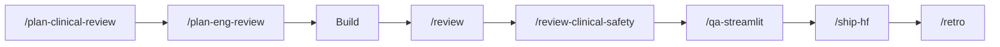

<p align="center">
  
  
  
</p>

# 🩺 NurseStack

**Claude Code workflows built by nurses, for nurses.**

5 healthcare-specific slash commands that give Claude Code a clinical brain — NMC standards, patient safety, FHIR compliance, Streamlit QA, and Hugging Face deployment. All in one install.

> *"Technology built by those who understand the ward is technology that works on the ward."*

Built on top of [gstack](https://github.com/garrytan/gstack) by [Garry Tan](https://x.com/garrytan). NurseStack extends gstack with commands designed for **clinical nursing tool development** in the UK NHS context.

---

## ⚡ What You Get

| Command | Role | What it does |
|---|---|---|
| `/plan-clinical-review` | Senior Clinical Nurse | NMC-aligned product review — ensures you're building the right thing for nurses and patients |
| `/review-clinical-safety` | Clinical Safety Officer | DCB0129/DCB0160 safety audit — hazard identification, risk classification, mitigation |
| `/qa-streamlit` | QA Engineer (Streamlit) | Test Streamlit apps locally or on Hugging Face Spaces — widgets, session state, clinical content |
| `/ship-hf` | Release Engineer | Ship to GitHub AND Hugging Face Spaces in one command |
| `/review-fhir` | FHIR Specialist | FHIR IG profiling, terminology binding, UK NHS interoperability audit |

Plus all 8 original **gstack commands**: `/plan-ceo-review`, `/plan-eng-review`, `/review`, `/ship`, `/browse`, `/qa`, `/setup-browser-cookies`, `/retro`

**Total: 13 commands. One install.**

---

## 🎯 Who This Is For

You're a **nurse citizen developer** — a registered nurse, nursing student, or practice educator who builds open-source clinical tools. You use Claude Code. You juggle multiple repos. You don't have a QA team, a release engineer, or a clinical safety officer on speed dial.

NurseStack gives you all four.

---

## 📦 Install

### Prerequisites

1. **[Claude Code](https://docs.anthropic.com/en/docs/claude-code)** — Anthropic's CLI
2. **[gstack](https://github.com/garrytan/gstack)** — Install first:
   ```bash
   git clone https://github.com/garrytan/gstack.git ~/.claude/skills/gstack && cd ~/.claude/skills/gstack && ./setup
   ```
3. **[Bun](https://bun.sh/)** v1.0+ (required by gstack for `/browse`):
   ```bash
   curl -fsSL https://bun.sh/install | bash
   ```

### Install NurseStack

**Option A: Install globally** (available in all projects)
```bash
git clone https://github.com/Clinical-Quality-Artifical-Intelligence/nursestack.git /tmp/nursestack && /tmp/nursestack/install.sh && rm -rf /tmp/nursestack
```

**Option B: Install in a specific project** (committed to repo, teammates get it)
```bash
git clone https://github.com/Clinical-Quality-Artifical-Intelligence/nursestack.git /tmp/nursestack && /tmp/nursestack/install.sh --project && rm -rf /tmp/nursestack
```

**Option C: Manual** — Copy the `commands/` folder contents to `~/.claude/commands/` (global) or `.claude/commands/` (project).

---

## 🔬 Demo: Building a Nursing Tool

Here's the full NurseStack workflow for building a wound assessment tool:

```
You: /plan-clinical-review
     I want to build a wound assessment tool for nurses working with
     patients of all skin tones.

Claude: The real clinical need here isn't "wound assessment" — it's
        equitable wound assessment. Current tools fail on darker skin
        tones because they were trained on predominantly white skin...
        
        NMC Alignment: Platform 3 (Assessing needs), Platform 6 (Safety)
        Patient Safety: Class 2 — indirect risk if assessment is inaccurate
        Health Equity: HIGH POSITIVE IMPACT — directly addresses skin tone bias
        
        The 10-star version: AI-assisted wound staging calibrated across
        Fitzpatrick I-VI, with visual reference guides for each skin tone...

You: /plan-eng-review
Claude: [Architecture diagram, image pipeline, model selection, data flow]

You: [build the feature]

You: /review
Claude: [Code quality audit — race conditions, error handling, edge cases]

You: /review-clinical-safety
Claude: Safety Classification: Class 2 (indirect patient risk)
        Hazard: Incorrect wound staging → delayed treatment
        Mitigation: Always display confidence score + "verify clinically"
        BLOCKER: Missing clinical disclaimer on results page

You: /qa-streamlit
Claude: [Tests the Streamlit app — widgets, session state, clinical content]
        Clinical Accuracy Spot-Check:
        - Stage 2 pressure ulcer classification: PASS
        - Fitzpatrick VI wound colour assessment: PASS
        Recommendation: Fix disclaimer, then ship

You: /ship-hf
Claude: GitHub:    ✅ Pushed abc1234 to origin/main
        HF Spaces: ✅ Pushed to hf/main — building
        App live at huggingface.co/spaces/NurseCitizenDeveloper/wound-assessment
```

---

## 📋 Command Reference

### `/plan-clinical-review`

**Your clinical product lead.** Use this INSTEAD of `/plan-ceo-review` when building nursing tools.

Asks the hard clinical questions before a line of code is written:
- Who is the real user? (Student on placement? Nurse on a night shift?)
- Does this reinforce or replace clinical judgment?
- Which NMC proficiency platforms does this serve?
- What are the DCB0129 patient safety implications?
- Could this widen or narrow health inequalities?
- Would a charge nurse on a night shift actually use this?

### `/review-clinical-safety`

**Your clinical safety officer.** A structured DCB0129/DCB0160 audit.

Performs:
- Hazard identification (wrong info, unavailability, misinterpretation)
- Risk classification (severity × likelihood → risk level)
- Mitigation verification (disclaimers, validation, clinical verifiability)
- Clinical content accuracy (BNF, NICE, NMC sources)
- Information governance (GDPR, patient data handling)

### `/qa-streamlit`

**Your Streamlit QA engineer.** Tests Streamlit apps thoroughly:
- App startup and dependency checks
- UI rendering via `/browse`
- Session state and widget behaviour
- Streamlit-specific quirks (reruns, caching)
- Clinical content spot-checks
- Hugging Face Spaces compatibility (requirements.txt, YAML config)

### `/ship-hf`

**Your release engineer for the full pipeline.** Ships to both GitHub and Hugging Face Spaces:
- Pre-flight checks (git state, requirements.txt, README YAML, disclaimer)
- Push to GitHub
- Push to Hugging Face Spaces
- Post-ship verification via `/browse`

### `/review-fhir`

**Your FHIR interoperability specialist.** For the Open Nursing Core IG and FHIR projects:
- R4 resource conformance
- Terminology binding (SNOMED CT UK edition, LOINC, dm+d)
- Nursing-specific profiles (NEWS2, Waterlow, ADPIE care plans)
- UK NHS compatibility (UKCore, NHS Number, ODS codes)
- IG publisher config validation

---

## 📐 NMC Standards Alignment

All NurseStack commands are designed with the **NMC Standards of Proficiency for Registered Nurses (2018)** in mind:

| Platform | NurseStack Coverage |
|---|---|
| 1. Being an accountable professional | `/plan-clinical-review` checks clinical accountability |
| 2. Promoting health and preventing ill health | Health equity impact assessment |
| 3. Assessing needs and planning care | Clinical content accuracy checks |
| 4. Providing and evaluating care | `/qa-streamlit` clinical spot-checks |
| 5. Leading and managing nursing care | `/retro` for team reflection |
| 6. Improving safety and quality of care | `/review-clinical-safety` DCB0129 audit |
| 7. Coordinating care | `/review-fhir` interoperability checks |

---

## 🏗️ Project Structure

```
nursestack/
├── README.md                          # This file
├── LICENSE                            # MIT
├── install.sh                         # Install script
├── commands/
│   ├── plan-clinical-review.md        # NMC-aligned clinical product review
│   ├── review-clinical-safety.md      # DCB0129/DCB0160 safety audit
│   ├── qa-streamlit.md                # Streamlit + HF Spaces QA
│   ├── ship-hf.md                     # Ship to GitHub + Hugging Face
│   └── review-fhir.md                # FHIR IG compliance audit
├── templates/
│   └── CLAUDE.md                      # Drop-in project config
└── examples/
    └── workflow-demo.md               # Full workflow example
```

---

## 🔄 Recommended Workflow



---

## 🤝 Contributing

NurseStack is built by the **Nurse Citizen Developer** community. Contributions welcome!

- **New commands** — Got a clinical workflow that needs a dedicated mode? Open a PR.
- **Improve existing commands** — Better prompts, more clinical checks, wider coverage.
- **Bug reports** — If a command gives clinically inappropriate advice, that's a safety issue. Report it.

---

## 👥 About

### Clinical Quality Artificial Intelligence
A UK-based open-source organisation building free AI tools for nursing education and clinical practice.

**Founder:** Lincoln Gombedza, RNLD — Registered Learning Disability Nurse | Practice Educator | Nurse Citizen Developer

**Key Collaborator:** Kelly Thobekile Ncube, RN — Senior Lecturer in Adult Nursing (SFHEA) | Global Health Lecturer Volunteer Fellow

### Credits
- **[gstack](https://github.com/garrytan/gstack)** by Garry Tan — NurseStack is built on top of gstack's excellent foundation
- **[Claude Code](https://docs.anthropic.com/en/docs/claude-code)** by Anthropic — the AI coding assistant that powers it all

---

## 📄 License

MIT — same as gstack. Free to use, modify, and distribute.

---

<p align="center">
  <strong>Built by nurses who code. For nurses who care.</strong>
</p>
